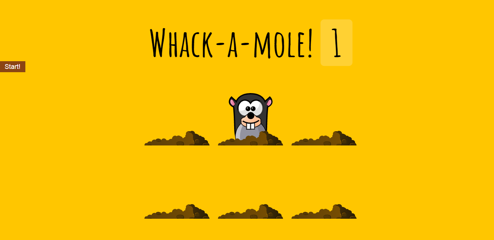

# Whack a Mole

## Task decomposition for Whack A Mole game:

1. Create HTML structure
- Create a title with "Whack-a-mole!" and a score element.
- Create a button with "Start!" text.
- Create a div with the class "game".
- Inside the "game" div, create 6 holes (divs) with the class "hole".
- Inside each "hole" div, create a mole (div) with the class "mole".
2. Create CSS styles
- Style the title, score, button, game, holes, and moles according to the provided styles.
3. Create variables and functions
- Create variables to select the holes, score board, and moles.
- Create variables to keep track of the last hole, timeUp, and score.
- Create a function "randomTime" that generates a random time between a minimum and maximum value.
- Create a function "randomHole" that selects a random hole and prevents the same hole from being selected twice in a row.
- Create a function "peep" that selects a random hole and makes the mole pop up for a random amount of time using the "up" class.
- Create a function "startGame" that resets the score and timeUp variables and starts the "peep" function using setTimeout to run for 10 seconds.
- Create a function "bonk" that increases the score when the mole is clicked and removes the "up" class from the hole.
4. Add event listeners
- Add a "click" event listener to each mole that calls the "bonk" function.
- Add a "click" event listener to the "Start!" button that calls the "startGame" function.